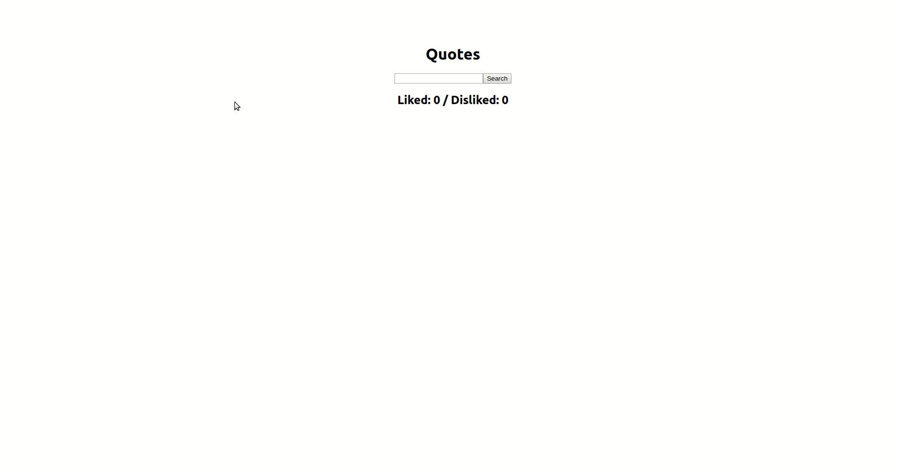

# Quote Garden

## 🌿 [Check out the demo here](#Demo) 🌿

## Table of contents

- [Preface](#Preface)
- [Demo](#Demo)
- [How to start](#How-to-start)
- [Technologies used for this project](#Technologies-used-for-this-project)

## Preface

This project was built in week 3 of the Codaisseur bootcamp. The goal was to build an app in 1 day using React, where quotes of the public "Quote Garden" API can be interactively explored.

## Demo

## How to start

1. Clone the git repository into a new directory on your computer using the following command: `git clone git@github.com:cynthiameiring/Quote-Garden.git`
2. Run `npm install` in your terminal to install all the dependencies
3. Run `npm run start` to start the app locally on your computer

## Technologies used for this project

- React with `create-react-app`
- Public Quote Garden API
